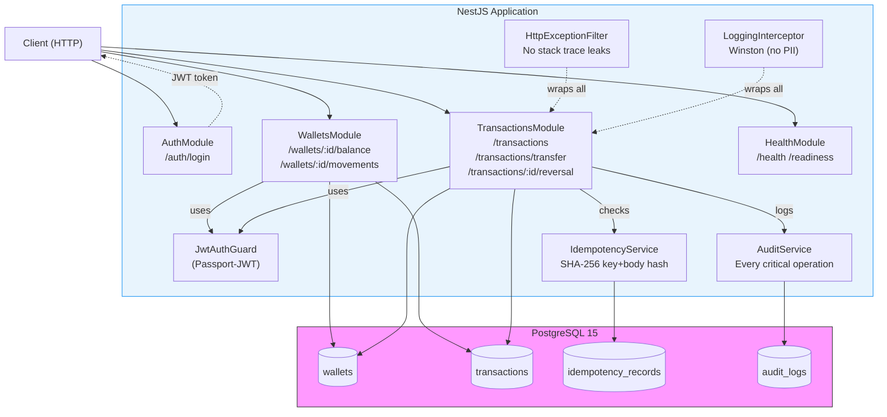

## Key Design Decisions

| Concern | Decision | Reason |
|---|---|---|
| Arithmetic | `Decimal.js` for all money ops | Avoids IEEE-754 float errors |
| Atomicity | `DataSource.transaction()` with `EntityManager` | Guaranteed rollback on any failure |
| Deadlock prevention | Lock wallets in sorted ID order | Consistent lock ordering prevents AB/BA deadlock |
| Idempotency | SHA-256 of request body stored per key | Same key + different body → 409 Conflict |
| Currency storage | `NUMERIC(20,2)` in Postgres | Never float in DB |
| Error responses | Global `HttpExceptionFilter` | Stack traces never reach clients |
| Logs | Winston with `errors({ stack: false })` | No sensitive data in logs |
| Auth | JWT validated by Passport guard | Stateless, standard |
| Audit | Every critical op writes to `audit_logs` within same transaction | Guaranteed consistency |
